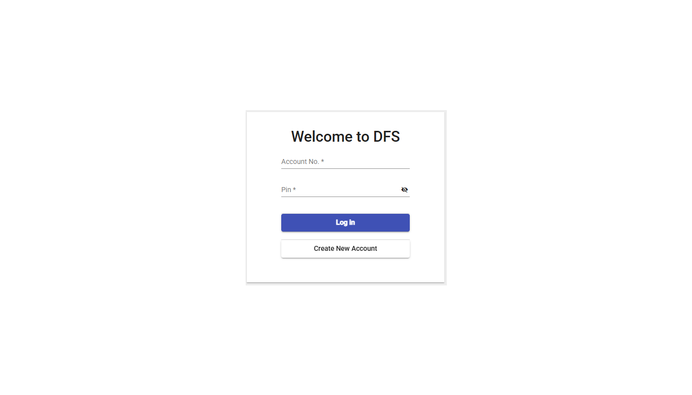
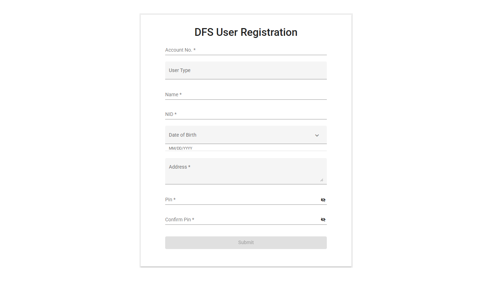
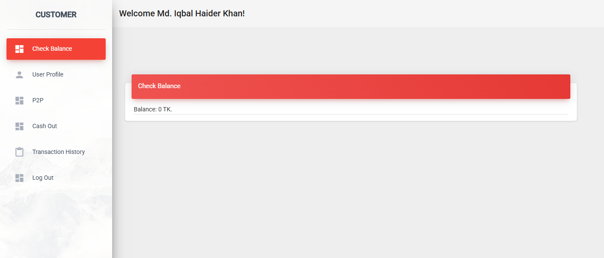
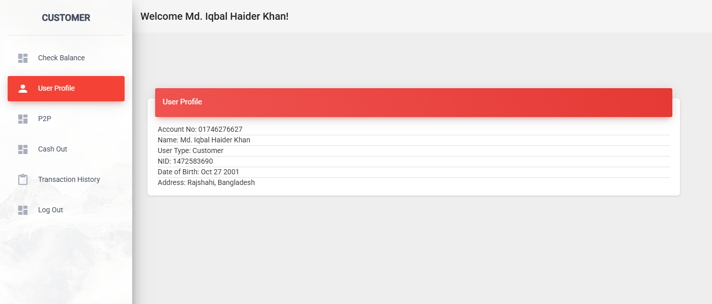
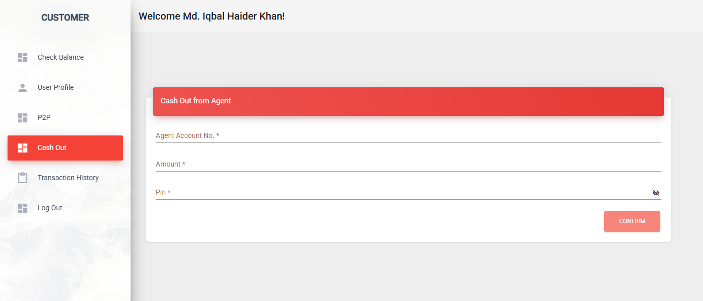
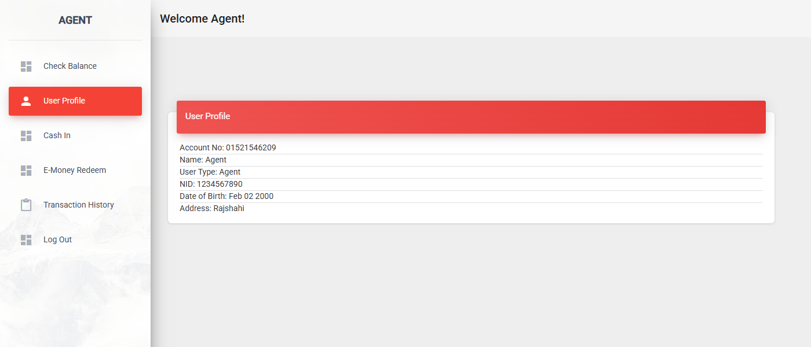
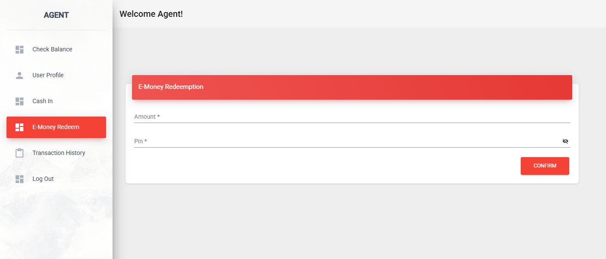
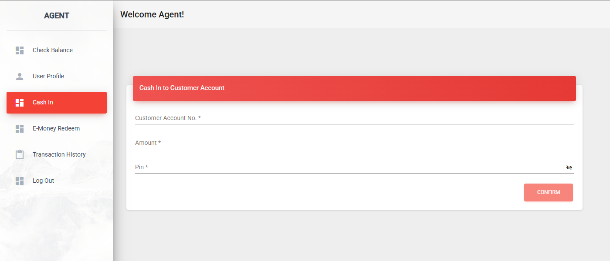

# mobile-financial-service

Features:
1. P2P
2. Cash in
3. Cash Out
4. B2B
5. E-Money Create & Destroy# Digital Financial Service

This is a full-stack mobile financial service application featuring a complete suite of tools for both customers and agents. The front end is built with Angular, and the back end is powered by Spring Boot.

## Overview

This application provides a secure and reliable platform for digital financial transactions. It includes separate interfaces for customers and agents, each with a unique set of features tailored to their needs. The project is designed to be scalable and easy to set up for development.

### Features

* **P2P Transfers:** Customers can send money directly to other users.
* **Cash In/Out:** Agents can facilitate cash deposits and withdrawals for customers.
* **B2B Transactions:** The system supports business-to-business transactions.
* **User Roles:** Separate dashboards and functionalities for customers, agents, and system administrators.
* **Transaction History:** Users can view a complete history of their transactions.

---

## Setup and Installation

To get the project up and running, you will need to set up the back end and front end separately.

### Backend (Spring Boot)

1.  **Prerequisites:**
    * Java 17
    * Gradle

2.  **Database Configuration:**
    * This project uses a MySQL database. You can use a local or a remote SQL server.
    * Create a new database.
    * Update the `src/main/resources/application.properties` file with your database credentials:
        ```properties
        spring.datasource.url=jdbc:mysql://<your_hostname>:<your_port>/<your_database>
        spring.datasource.username=<your_username>
        spring.datasource.password=<your_password>
        ```
    * The application will automatically create the necessary tables when it starts.

3.  **Run the Application:**
    * Open a terminal in the `mobile-financial-service` directory.
    * Run the command: `./gradlew bootRun`
    * The back end will be running on `http://localhost:8085`.

### Frontend (Angular)

1.  **Prerequisites:**
    * Node.js and npm
    * Angular CLI (`npm install -g @angular/cli`)

2.  **Install Dependencies:**
    * Open a terminal in the `digital-financial-service-ui` directory.
    * Run the command: `npm install`

3.  **Run the Application:**
    * In the same terminal, run the command: `npm start`
    * The front end will be running on `http://localhost:4200/`.

---

## Technology Stack

* **Frontend:**
    * Angular
    * Bootstrap 4 (Note: This project uses Bootstrap 4. Do not upgrade to Bootstrap 5, as it will cause compatibility issues.)
    * SASS
* **Backend:**
    * Spring Boot
    * Java 17
    * MySQL

---

## Screenshots

### Login and Registration

| Login                                     | Registration                                |
| ----------------------------------------- | ------------------------------------------- |
|  |  |

### Customer Dashboard

| Customer Dashboard 1                          | Customer Dashboard 2                          | Customer Dashboard 3                          |
| --------------------------------------------- | --------------------------------------------- | --------------------------------------------- |
|  |  |  |

### Agent Dashboard

| Agent Dashboard 1                       | Agent Dashboard 2                       | Agent Dashboard 3                       |
| --------------------------------------- | --------------------------------------- | --------------------------------------- |
|  |  |  |